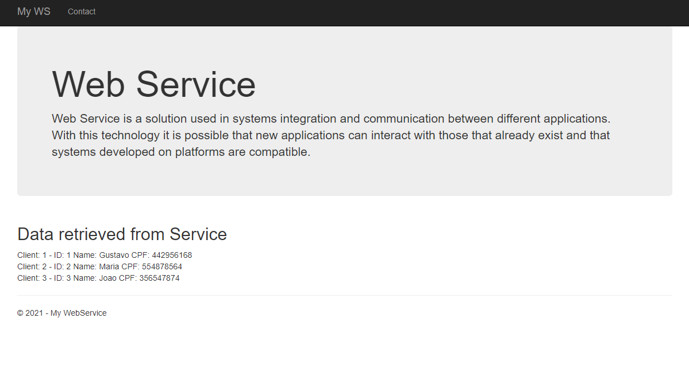

<h1 align="center">
    
</h1>

## 💻 Projeto

Esse projeto foi desenvolvido com o intuito de aprender sobre como é feita a construção de um WebService para troca de dados entre aplicações, me aprofundar em protocolos HTTP, serialização e desserialização de dados.

